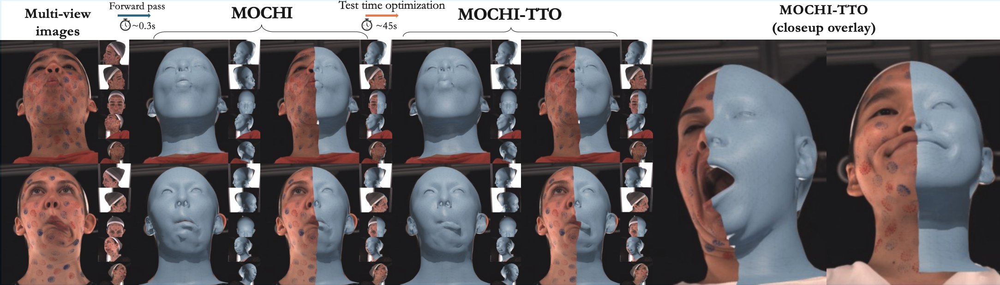

<div align="center">

<h1>MOCHI</h1>

<h3>Registration-Free Learnable Multi-View Capture of Faces<br>in Dense Semantic Correspondence</h3>

<a href="https://filby89.github.io/mochi/" target="_blank" rel="noopener noreferrer"></a>
<a href="https://arxiv.org/abs/2605.01450" target="_blank" rel="noopener noreferrer"></a>
<a href="https://www.youtube.com/watch?v=-dicD0PMbC8" target="_blank" rel="noopener noreferrer"></a>

<p>
  <a href="https://filby89.github.io" target="_blank" rel="noopener noreferrer">Panagiotis P. Filntisis</a> &nbsp;·&nbsp;
  <a href="https://georgeretsi.github.io" target="_blank" rel="noopener noreferrer">George Retsinas</a> &nbsp;·&nbsp;
  <a href="https://radekd91.github.io" target="_blank" rel="noopener noreferrer">Radek Danecek</a> &nbsp;·&nbsp;
  <a href="https://vanessik.github.io" target="_blank" rel="noopener noreferrer">Vanessa Sklyarova</a> &nbsp;·&nbsp;
  <a href="https://robotics.ntua.gr/members/maragos/" target="_blank" rel="noopener noreferrer">Petros Maragos</a> &nbsp;·&nbsp;
  <a href="https://sites.google.com/site/bolkartt/" target="_blank" rel="noopener noreferrer">Timo Bolkart</a>
</p>

<h4>CVPR 2026</h4>

</div>

<p align="center">
  
  <br>
  <em>MOCHI predicts topologically consistent 3D face meshes in dense semantic correspondence directly from calibrated multi-view images, and a test-time optimization (MOCHI-TTO) pass further sharpens the geometry.</em>
</p>


---

## 1. Installation

The code targets **Python 3.10** and **CUDA 12.4**. Create a fresh environment and run the
installer:

```bash
python3.10 -m venv .venv
source .venv/bin/activate
bash install.sh
```

`install.sh` pulls PyTorch 2.5.1 (cu124), pytorch3d 0.7.8, MPI-IS `mesh`, kaolin, kornia,
pyrender, trimesh, wandb, etc., and builds the vendored `liegroups` package under
`modules/liegroups`. On a headless node, export
`PYOPENGL_PLATFORM=egl` before launching to use EGL rendering.


## 2. Data

MOCHI uses the **FaMoS** dataset, released as part of
[TEMPEH](https://tempeh.is.tue.mpg.de/). Follow the following steps to prepare the data.

**a) Download FaMoS.** Register at <https://tempeh.is.tue.mpg.de/> and agree to the license,
then use the (TEMPEH-provided) fetch scripts under [`famos_download/`](famos_download/) — see
[`famos_download/README.md`](famos_download/README.md) for details:

```bash
cd famos_download
bash fetch_test_subset.sh     # quick start: small paper test subset
bash fetch_training_data.sh   # full training set (images, scans, FLAME registrations)
bash fetch_test_data.sh       # full test set
cd ..
```

**b) Preprocess into multi-view grids.** Follow [`datasets/preprocess.md`](datasets/preprocess.md),
which uses [`datasets/build_grids.py`](datasets/build_grids.py) to render the
ground-truth normal/depth maps from the scans and pack them, alongside the multi-view RGB,
cameras, and dense landmarks, into the grid layout the trainer reads.

## 3. Demo

A minimal forward-only run of the trained coarse + local models on the small FaMoS test subset,
writing the predicted FLAME-topology mesh per frame. No preprocessing, scans or landmarks are
needed — `demo.py` consumes the raw multi-view captures directly. Place the released
`global.pth` and `local.pth` under `pretrained_models/`, then:

```bash
# 1) fetch the small test subset (prompts for FaMoS/TEMPEH credentials)
cd famos_download && bash fetch_test_subset.sh && cd ..

# 2) run MOCHI on it
python demo.py \
  -local True \
  --pretrained-path pretrained_models/global.pth \
  --pretrained-local-path pretrained_models/local.pth \
  -tdl famos_download/data/test_data_subset/paper_test_frames.json \
  --image-directory famos_download/data/test_data_subset/test_subset_images_4 \
  --calibration-directory famos_download/data/test_data_subset/test_subset_calibrations \
  -eid demo
```

Predicted meshes are written to `runs/demo/demo_meshes/*.ply`.

## 4. Training

The model trains in three sequential stages, with an optional fourth test-time-optimization
pass. Edit the data paths in [`scripts/_data_paths.sh`](scripts/_data_paths.sh), then run the
stage launchers in order:

```bash
bash scripts/stage1_pretrain.sh   # coarse, no differentiable rendering
bash scripts/stage2_coarse.sh     # coarse + differentiable rendering   (needs stage 1)
bash scripts/stage3_local.sh      # local refinement                    (needs stage 2)
bash scripts/stage4_refine.sh     # optional per-scene TTO              (needs stage 3)
```

## Acknowledgements

This work builds directly on **[TEMPEH](https://tempeh.is.tue.mpg.de/)** (MPI-IS, 2023); much
of the multi-view volumetric backbone and data tooling derives from it. We also use
**[FLAME](https://flame.is.tue.mpg.de/)** and **[pytorch3d](https://pytorch3d.org/)** /
**[kaolin](https://github.com/NVIDIAGameWorks/kaolin)** for differentiable rendering.

## License

See the [LICENSE](./LICENSE) file. This repository builds on the TEMPEH codebase; please respect
the upstream license terms at <https://tempeh.is.tue.mpg.de/license.html>.

## Citation

If you find this work useful, please consider citing:

```bibtex
@inproceedings{filntisis2026mochi,
    title     = {Registration-Free Learnable Multi-View Capture of Faces in Dense Semantic Correspondence},
    author    = {Filntisis, Panagiotis P. and Retsinas, George and Daněček, Radek and Sklyarova, Vanessa and Maragos, Petros and Bolkart, Timo},
    booktitle = {Conference on Computer Vision and Pattern Recognition (CVPR)},
    year      = {2026}
}
```
