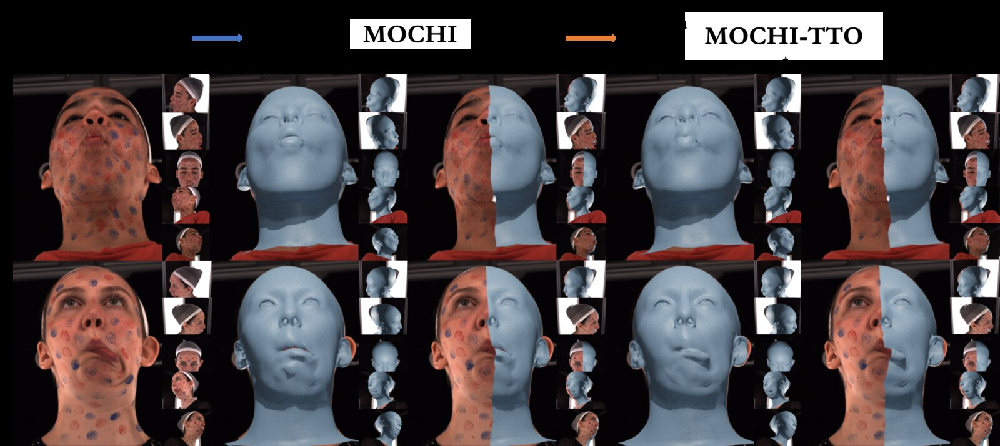

<div align="center">

<h1>MOCHI</h1>

<h3>Registration-Free Learnable Multi-View Capture of Faces<br>in Dense Semantic Correspondence</h3>

<a href="https://filby89.github.io/mochi/" target="_blank" rel="noopener noreferrer"></a>
<a href="https://arxiv.org/abs/2605.01450" target="_blank" rel="noopener noreferrer"></a>
<a href="https://www.youtube.com/watch?v=-dicD0PMbC8" target="_blank" rel="noopener noreferrer"></a>

<p>
  <a href="https://filby89.github.io" target="_blank" rel="noopener noreferrer">Panagiotis P. Filntisis</a> &nbsp;·&nbsp;
  <a href="https://georgeretsi.github.io" target="_blank" rel="noopener noreferrer">George Retsinas</a> &nbsp;·&nbsp;
  <a href="https://radekd91.github.io" target="_blank" rel="noopener noreferrer">Radek Danecek</a> &nbsp;·&nbsp;
  <a href="https://vanessik.github.io" target="_blank" rel="noopener noreferrer">Vanessa Sklyarova</a> &nbsp;·&nbsp;
  <a href="https://robotics.ntua.gr/members/maragos/" target="_blank" rel="noopener noreferrer">Petros Maragos</a> &nbsp;·&nbsp;
  <a href="https://sites.google.com/site/bolkartt/" target="_blank" rel="noopener noreferrer">Timo Bolkart</a>
</p>

<sub>CVPR 2026</sub>

</div>

<p align="center">
  
  <br>
  <em>MOCHI predicts topologically consistent 3D face meshes in dense semantic correspondence directly from multi-view images, and a test-time optimization (MOCHI-TTO) pass further sharpens the geometry.</em>
</p>

---

MOCHI is a framework for predicting 3D face meshes from multi-view images **without requiring
registered training data**. It enforces topological consistency through a pseudo-linear inverse
kinematic solver (**PLIKS**), guides semantic alignment with dense keypoints from a
synthetic-data-trained landmark detector, and is supervised with **pointmap- and normal-based
losses** that avoid the training instabilities of standard distance metrics. An optional
**test-time optimization (TTO)** pass refines the prediction per scene.

This release reproduces the full pipeline on FaMoS data.

---

## 1. Installation

The code targets **Python 3.10** and **CUDA 12.4**. Create a fresh environment and run the
installer:

```bash
python3.10 -m venv .venv
source .venv/bin/activate
bash install.sh
```

`install.sh` pulls PyTorch 2.5.1 (cu124), pytorch3d 0.7.8, MPI-IS `mesh`, kaolin, kornia,
pyrender, trimesh, wandb, etc., and builds the vendored `liegroups` package under
`modules/liegroups`. A working compiler toolchain is required. On a headless node, export
`PYOPENGL_PLATFORM=egl` before launching to use EGL rendering.

## 2. FLAME assets

Small project-specific assets (template, region masks, landmark embeddings, example data lists)
ship with the repo under `assets/`. The **FLAME model files are not redistributed** — download
them from <https://flame.is.tue.mpg.de/> after accepting the license and place them as:

```
assets/FLAME2023/flame2023_no_jaw.pkl    # loaded by default
assets/FLAME2023/flame2023.pkl
assets/FLAME_masks/FLAME_masks.pkl
```

## 3. Data

MOCHI uses the **FaMoS** dataset, released as part of
[TEMPEH](https://tempeh.is.tue.mpg.de/). The trainer consumes it as **undistorted, pre-rendered
multi-view RGB / normal / depth grids**, so preparation is two steps.

**a) Download FaMoS.** Register at <https://tempeh.is.tue.mpg.de/> and agree to the license,
then use the (TEMPEH-provided) fetch scripts under [`famos_download/`](famos_download/) — see
[`famos_download/README.md`](famos_download/README.md) for details:

```bash
cd famos_download
bash fetch_test_subset.sh     # quick start: small paper test subset
bash fetch_training_data.sh   # full training set (images, scans, FLAME registrations)
bash fetch_test_data.sh       # full test set
cd ..
```

**b) Preprocess into multi-view grids.** Follow [`datasets/preprocess.md`](datasets/preprocess.md),
which uses [`render_normals_undistorted_test.py`](render_normals_undistorted_test.py) to
undistort the views and render the ground-truth normal/depth grids the trainer reads, and
documents the expected output layout.

## 4. Training

The model trains in three sequential stages, with an optional fourth test-time-optimization
pass. Edit the data paths in [`scripts/_data_paths.sh`](scripts/_data_paths.sh), then run the
stage launchers in order:

```bash
bash scripts/stage1_pretrain.sh   # coarse, no differentiable rendering
bash scripts/stage2_coarse.sh     # coarse + differentiable rendering   (needs stage 1)
bash scripts/stage3_local.sh      # local refinement                    (needs stage 2)
bash scripts/stage4_refine.sh     # optional per-scene TTO              (needs stage 3)
```

Each script is a thin wrapper around the two entry points:

```bash
python -m trainer.train         # stages 1–3  (trainer.global_trainer)
python -m trainer.train_refine  # stage 4 TTO (trainer.refiner)
```

See the script headers for the exact CLI arguments used to produce the released results.

## Acknowledgements

This work builds directly on **[TEMPEH](https://tempeh.is.tue.mpg.de/)** (MPI-IS, 2023); much
of the multi-view volumetric backbone and data tooling derives from it. We also use
**[FLAME](https://flame.is.tue.mpg.de/)** and **[pytorch3d](https://pytorch3d.org/)** /
**[kaolin](https://github.com/NVIDIAGameWorks/kaolin)** for differentiable rendering.

## License

See the [LICENSE](./LICENSE) file. This repository builds on the TEMPEH codebase; please respect
the upstream license terms at <https://tempeh.is.tue.mpg.de/license.html>.

## Citation

If you find this work useful, please consider citing:

```bibtex
@inproceedings{filntisis2026mochi,
    title     = {Registration-Free Learnable Multi-View Capture of Faces in Dense Semantic Correspondence},
    author    = {Filntisis, Panagiotis P. and Retsinas, George and Daněček, Radek and Sklyarova, Vanessa and Maragos, Petros and Bolkart, Timo},
    booktitle = {Conference on Computer Vision and Pattern Recognition (CVPR)},
    year      = {2026}
}
```
